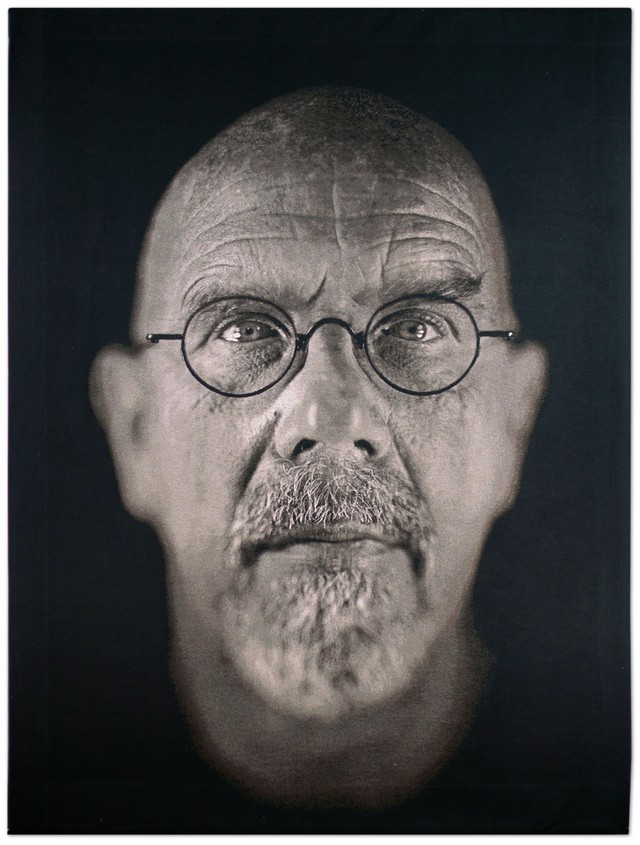
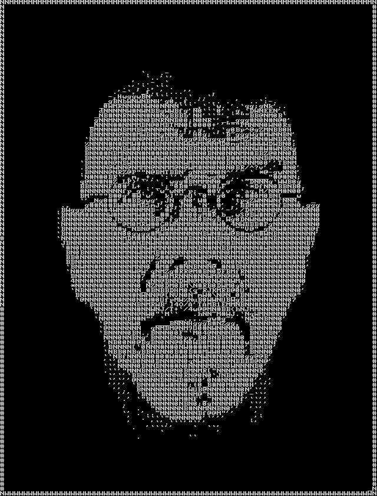

# Photomosaic API

An API for turning gifs and images into photomosaics

## Installation

clone the repository

```bash
git clone https://github.com/rjvanvoorhis/photomosaic-api.git
```

Set these Environmental Variables

```bash
export FAAS_URL='http://faas-swarm:8080'
export MONGODB_URI=mongodb://mongodb:27017/
export SECRET_KEY={my_super_secret_key}
export MOSAIC_API_URL='http://mosaic-api:5000/api/v1/photomosaic'
export MAIL_USERNAME={an email account}
export MAIL_PASSWORD={email password}
export AWS_SECRET_ACCESS_KEY={value}
export AWS_ACCESS_KEY_ID={value}
export S3_ENDPOINT_URL='http://localstack-s3:4572/'
export S3_EXTERNAL_URL='http://localhost:4572/'
export MEDIA_BUCKET='images'
```

run 
```bash
docker-compose up
```

then navigate to http://localhost:5000/ and 
take a look at the SwaggerUI


## Usage

### Create a user with 

```bash 
curl -X POST "http://127.0.0.1:5000/api/v1/photomosaic/registration"
 -H "Content-Type: application/json" -d "{ \"username\": \"my_username\", \"password\": \"my_password\"
 \"email\": \"my_email@domain.com\"}"
```

### With that username, upload a file

```
bash
curl -X POST "http://127.0.0.1:5000/api/v1/photomosaic/users/rjvanvoorhis/uploads" 
-H  "accept: application/json" -H  "Content-Type: multipart/form-data" 
-F "file=@chuck_close.jpg;type=image/jpeg"
```



## Use the resulting file path to create a gallery item

```
bash
curl -X POST "http://127.0.0.1:5000/api/v1/photomosaic/users/rjvanvoorhis/gallery" 
-H  "accept: application/json" -H  "Content-Type: application/json" 
-d "{  \"path\": \"uploads/875608c7-e4b9-4200-87e9-3c70b1078b45_chuck_close.jpg\"

```
 # Take a look at the results


 

## License
[MIT](https://choosealicense.com/licenses/mit/)
